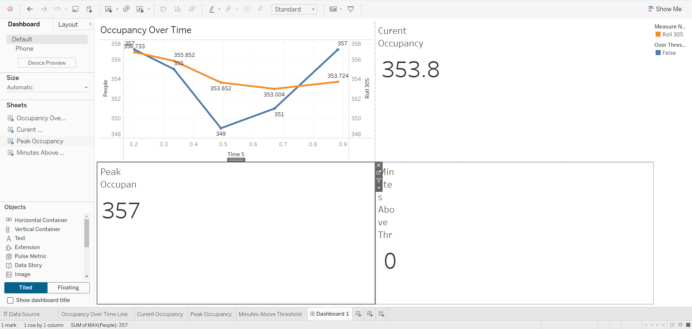

# Mahdin Rahman -# AI Crowd Density Monitoring System
## Model Training Notebook

The training pipeline and model experimentation are available in the Jupyter Notebook below:

[View Training Notebook](notebooks/crowd_density_training_model.ipynb)
Privacy-preserving AI system for monitoring crowd congestion in public-health environments using computer vision and data analytics.

## Overview

This project explores how AI can be used to estimate crowd density while protecting individual privacy. Traditional monitoring methods rely on manual observation and can be inconsistent.

This system uses a deep learning model to estimate crowd density from images and converts predictions into operational insights using data analytics dashboards.

## Solution

The system uses the TinyCSRNet deep learning model to generate density maps from crowd images. Model predictions are transformed into time-series occupancy metrics and visualized in a Tableau dashboard to monitor crowd trends and alert thresholds.

## Key Features

- AI-based crowd density estimation
- Time-series occupancy analytics
- Tableau dashboard for monitoring crowd activity
- Privacy-preserving design (no facial recognition or identity tracking)

## Technologies Used

Python  
PyTorch  
Computer Vision  
Tableau  
Data Visualization  

## Project Screenshots

### Density Map Prediction

### Occupancy Trend Dashboard

### Crowd Monitoring Visualization

## Future Improvements

- Improve model accuracy with larger datasets
- Deploy real-time monitoring pipeline
- Integrate automated alert systems
